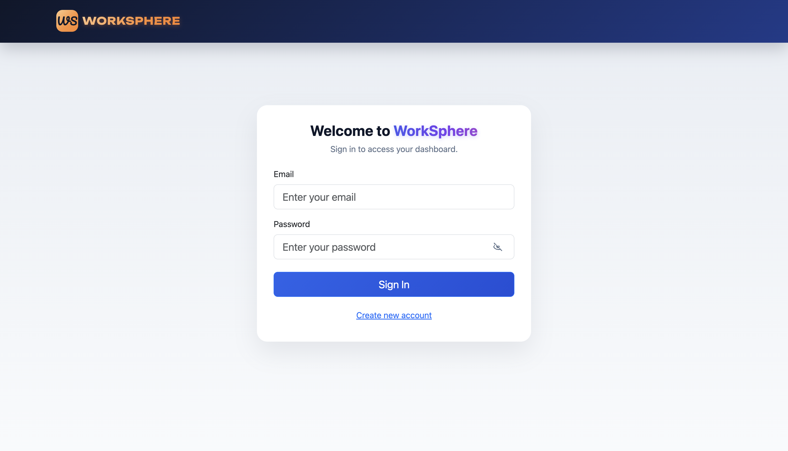
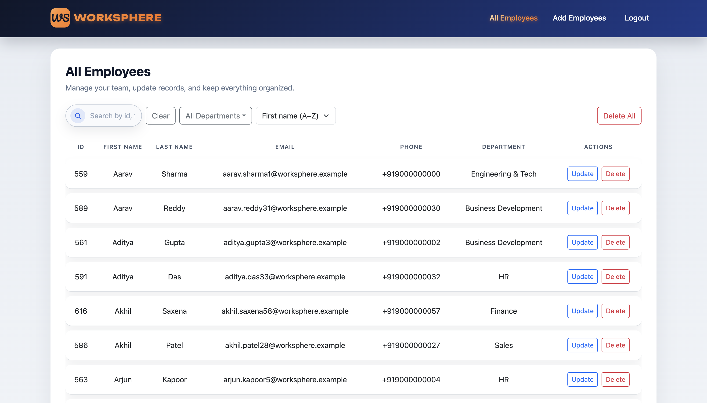

# WorkSphere - An Employee Management System

## About this

WorkSphere is a modern employee management platform built with React and Spring Boot. It provides secure role-based access, employee CRUD, bulk Excel uploads, and fast search with filtering, sorting, and pagination in a clean, responsive UI.


## Highlights

- JWT-based authentication with ADMIN/USER roles
- Employee CRUD operations (ADMIN)
- Bulk Excel upload (ADMIN)
- Department filters (multi-select) and sorting (first name A–Z / Z–A)
- Pagination and search
- Responsive React UI

## Screenshots




## Tech Stack

**Frontend**
- React + Vite
- Axios
- Bootstrap styles

**Backend**
- Spring Boot
- Spring Security + JWT
- Spring Data JPA
- MySQL
- Apache POI for Excel parsing

## Project Structure

```
ems-backend/   # Spring Boot API
ems-frontend/  # React UI
docs/images/   # Readme assets
```

## Features by Role

**ADMIN**
- Create, update, delete employees
- Bulk upload from Excel
- Delete all employees (confirmation required)

**USER**
- View and search employees
- Filter and sort employees

## API Overview

Base URL: `http://localhost:8081/api`

### Employees
- `GET /employees?page=0&size=20&department=HR,Sales&sortDir=asc`
- `GET /employees/search?query=john&page=0&size=20`
- `POST /employees` (ADMIN)
- `PUT /employees/{id}` (ADMIN)
- `DELETE /employees/{id}` (ADMIN)
- `DELETE /employees` (ADMIN)
- `POST /employees/bulk-upload` (ADMIN, multipart/form-data)

## Bulk Upload Format

Excel columns (case-insensitive):
- First Name
- Last Name
- Email
- Phone Number
- Department

Accepted file types: `.xlsx`, `.xls`

## Local Setup

### Backend
1. Configure MySQL and update [ems-backend/src/main/resources/application.properties](ems-backend/src/main/resources/application.properties)
2. Run the Spring Boot app

### Frontend
1. `npm install`
2. `npm run dev`

## Environment Variables (Production)

Set these in your hosting platform:

- `SPRING_DATASOURCE_URL`
- `SPRING_DATASOURCE_USERNAME`
- `SPRING_DATASOURCE_PASSWORD`
- `JWT_SECRET`
- `JWT_EXPIRATION_MS`

## Notes

- The employee list defaults to sorting by first name ascending.
- Department filter supports multiple selections.
